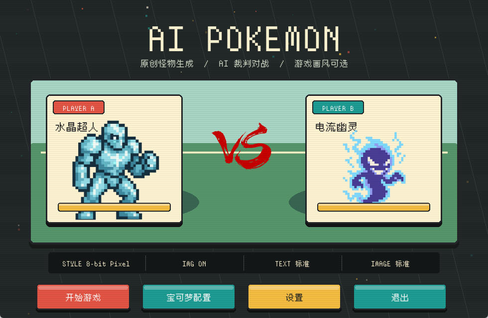
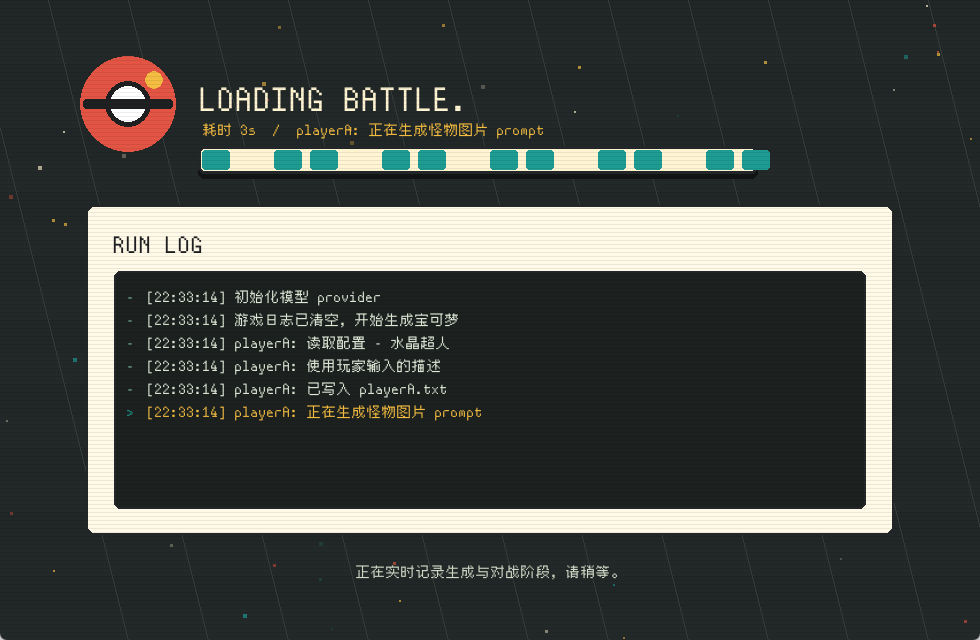
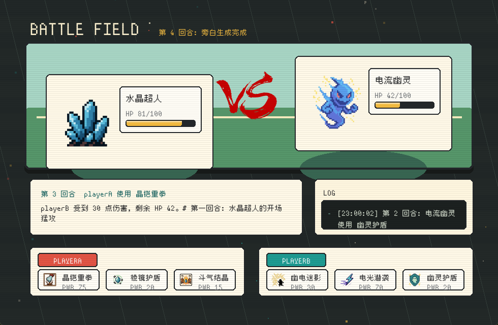

# AI Pokemon

一个用 AI 现场生成原创宝可梦、技能、图标和战斗旁白的像素风对战小游戏。项目已经从早期的 `main.ipynb` 拆成普通 Python 模块，并补上了 pygame 主界面、画风选择、模型配置、结构化战斗数据和一键启动入口。

## 游戏预览



主界面会展示双方宝可梦、当前画风、图片开关、文本模型档位和图片模型档位。玩家可以直接开始游戏，也可以进入配置页现场填写双方宝可梦名称与设定。



开始游戏后会进入实时加载页，详细显示 AI 生成流程：读取玩家配置、生成/补全描述、生成怪物图、生成技能 JSON、生成技能图标、初始化对战和记录每回合日志。



对战界面会像经典宝可梦游戏一样展示双方宝可梦、HP、技能和技能图标，并把最新回合的 AI 旁白、伤害与胜负状态同步呈现出来。

## 游戏卖点

- **原创宝可梦现场生成**：玩家只要输入名称和几句关键词，AI 就能补全设定、生成形象、技能和图标，每局都可以是不一样的怪物组合。
- **智能战斗结算**：战斗不是单纯随机扣血。AI 会根据双方设定、技能描述和本回合旁白判断优势、劣势或普通效果，再交给结构化伤害规则计算结果。
- **技能 JSON 化**：技能名称、描述、属性、类型、威力、命中率和效果都保存为结构化数据，前端展示和战斗逻辑都能稳定读取。
- **可切换画风**：通过 `art_styles.json` 配置 8-bit、写实、动画 RPG、低多边形、暗黑幻想等画风，让同一个设定可以生成完全不同的视觉版本。
- **多模型可插拔**：文本和图片 provider 可以分开配置，也可以在游戏设置里切换 `standard` / `fast` 档位，方便在质量和速度之间取舍。
- **可追踪的生成过程**：加载界面会实时显示详细日志，玩家能看到当前是在生成图片、技能、图标还是推进战斗。

## 当前功能

- 在游戏内配置 playerA / playerB 的宝可梦名称和描述。
- 描述可以留空，AI 会根据名字自动补全设定。
- 通过 `art_styles.json` 选择生成画风，例如 8-bit、写实、动画 RPG、低多边形、暗黑幻想等。
- 技能由 AI 输出 JSON，不再依赖字符串切分。
- 宝可梦、技能、伤害规则、回合结果和战斗状态都使用 dataclass 结构化表示。
- 对战过程由 AI 生成旁白，并由裁判逻辑判断优势、劣势或普通效果。
- 进入对战后展示双方宝可梦形象、HP、技能列表和技能图标，整体更接近经典宝可梦对战界面。
- 支持 OpenAI、DeepSeek、Gemini、Qwen、Doubao 等文本模型 provider。
- 支持 OpenAI / Gemini 图片生成 provider。
- 支持 `standard` 和 `fast` 两档模型速度配置。

## 快速开始

Windows 下最简单的方式是直接双击：

```text
Start_AI_Pokemon.bat
```

这个启动器会进入项目目录，检查 `pygame`，缺少时会自动安装，然后打开游戏主界面。

也可以手动启动：

```bash
python -m pip install pygame requests pillow numpy
python frontend.py
```

只跑核心生成与战斗逻辑：

```bash
python main.py
```

跳过图片生成，方便快速测试文本和战斗流程：

```bash
python main.py --no-images --seed 1
```

## 模型配置

在项目根目录创建 `.env`，按需填写 API key：

```env
AI_TEXT_PROVIDER=openai
AI_TEXT_SPEED=standard
AI_IMAGE_PROVIDER=openai
AI_IMAGE_SPEED=standard

OPENAI_API_KEY=your_openai_key
GEMINI_API_KEY=your_gemini_key
DEEPSEEK_API_KEY=your_deepseek_key
QWEN_API_KEY=your_qwen_key
DOUBAO_API_KEY=your_doubao_key
```

可选 provider：

- 文本：`openai`、`deepseek`、`gemini`、`qwen`、`doubao`
- 图片：`openai`、`gemini`
- 档位：`standard`、`fast`

如果设置了 `AI_TEXT_MODEL` 或 `AI_IMAGE_MODEL`，会优先使用手写模型名；否则会根据 `standard` / `fast` 自动选择默认模型。

## 游戏流程

1. 打开主界面。
2. 进入“宝可梦配置”，填写双方名称和描述。
3. 在“设置”中选择生成画风、文本 provider、图片 provider、模型档位和是否生成图片。
4. 点击“开始游戏”。
5. 等待 AI 生成角色、技能、图标和战斗日志。
6. 进入对战界面，查看双方 HP、技能、图标、回合旁白和胜负结果。

## 主要文件

- `frontend.py`：pygame 游戏界面。
- `main.py`：命令行入口和完整游戏流程。
- `ai_providers.py`：多 provider API 兼容层。
- `monster_builder.py`：宝可梦描述、图片、技能 JSON 和技能图标生成。
- `battle_engine.py`：回合推进、AI 旁白、裁判和伤害结算。
- `game_models.py`：宝可梦、技能、伤害规则和战斗状态 dataclass。
- `art_styles.json`：玩家可选画风配置。
- `Start_AI_Pokemon.bat`：Windows 一键启动入口。
- `artifact/`：README 截图素材。

## 生成产物

游戏运行后会更新或生成这些文件：

- `playerA.txt` / `playerB.txt`：当前玩家输入的宝可梦设定。
- `playerA/` / `playerB/`：生成的宝可梦图片、技能 JSON 和技能图标。
- `game_log.txt`：完整战斗日志。

这些文件会随着每次生成变化，属于本地运行产物。

## 开发状态

这个项目最早是 notebook 原型，现在主要逻辑已经模块化。联机功能仍保留在 `sever/` 目录里，暂时不是当前重点；当前版本优先完善单机生成、战斗展示和前端体验。
